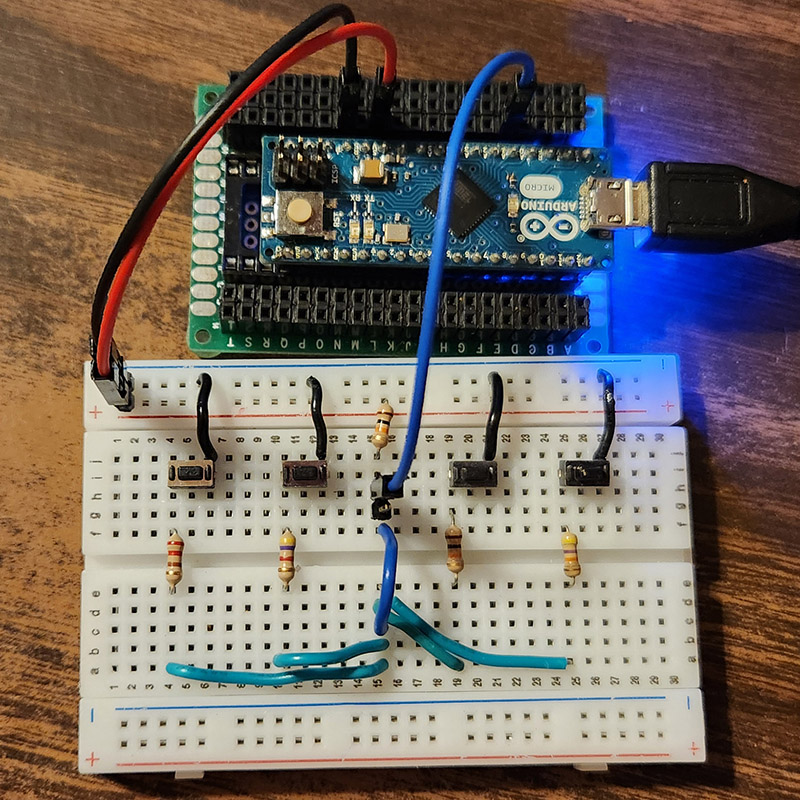
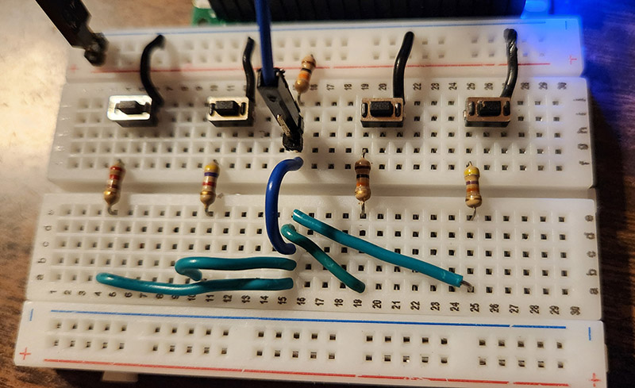
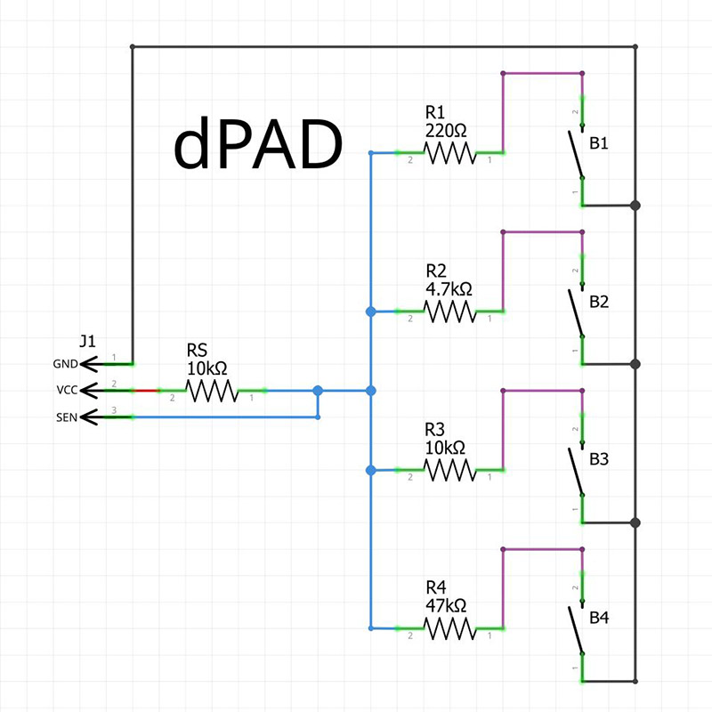
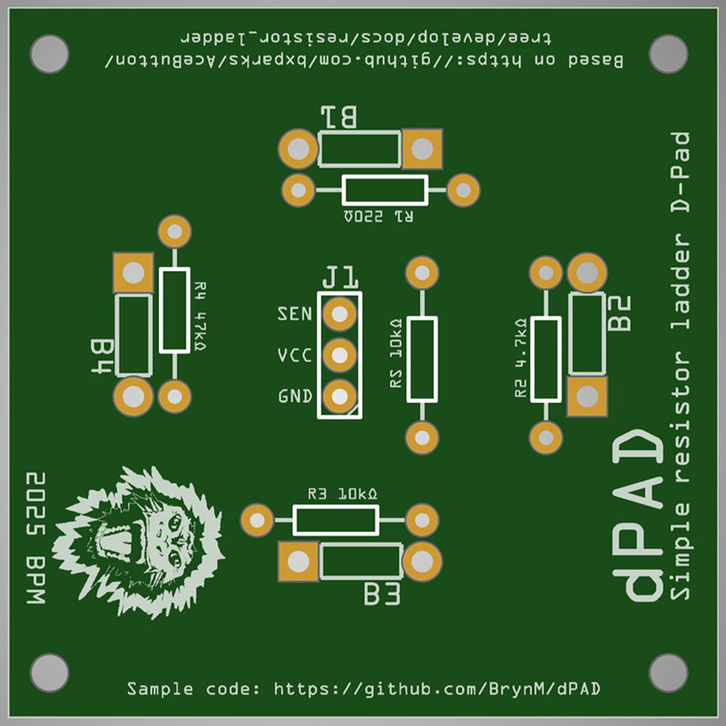

# dPAD

## Simple Resistor Ladder D-Pad

Based on the [great work](https://github.com/bxparks/AceButton/blob/develop/docs/resistor_ladder/README.md) by Brian Park (bxparks).

In particular, the PCB for dPAD implements the Parallel
Resistor Ladder schematic described by Brian. You rock
Brian!

This code written by 2025 Bryn Mosher (BPM). It and
the PCB design are Public Domain.

## Hardware

### Parts list for PCB Build

* 4 Small 3x6x5mm Inline Momentary Tactile Buttons
  The single kind with only two connectors. Not the
  four connector breadboard buttons. The ones that
  are half the size of the four connector ones.
* 1 47kΩ resistor
* 2 10kΩ resistors
* 1 4.7kΩ resistor
* 1 220Ω resistor
* 1 three pin header (male or female is your choice)
* Solder
* Soldering Iron
* Flux
* Patience

### Breadboarded

Consult the Fritzing file for building out your own
breadboard version.

### Schematic

Simple. Easy. [Go read what Brian Parks did.](https://github.com/bxparks/AceButton/blob/develop/docs/resistor_ladder/README.md)

### PCB

The fritzing file has the basics of getting the PCB
printed. For the more advanced users or those using
services that requier them, there is also a zip
containing Gerber files.

## Code

I've written AVR sample code for using the dPAD. The
code is well-commented and should be self-explanatory.
